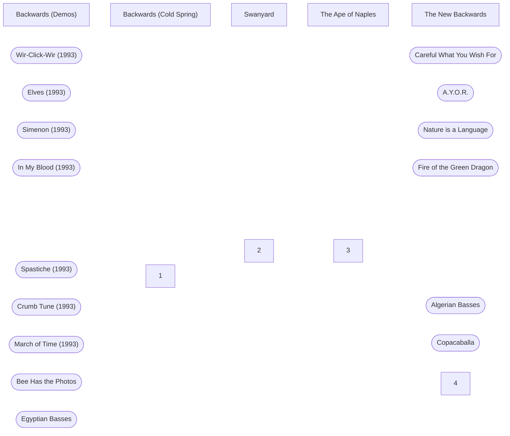

# Backwards

**********************_____Backwards**_ was the name of a long-term album project by Coil. Initially started in 1992 as the follow-up studio album to [Love’s Secret Domain](https://www.notion.so/Love-s-Secret-Domain-5bcf1b35bbb741a2afaf89d45766e6b8?pvs=21), the project would be reworked numerous times over the next 18 years, never being released in its originally intended form. Despite this, material created for this project would see a release on numerous Coil releases in various ways.

---

## History

### Follow-up to LSD

???

The last public mention of the project before it morphed into ____TAoN____ and *__TNB__* was as part of the *________________Song of the Week________________* project on

## Releases of *Backwards*-related Material
!![[Backwards (Demos)]]
