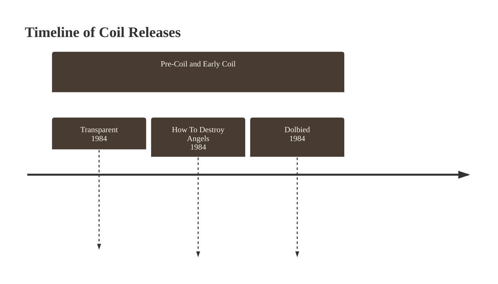
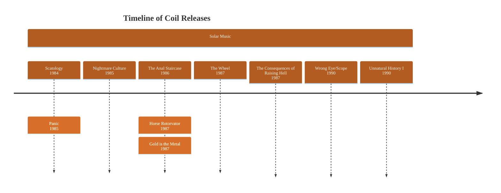
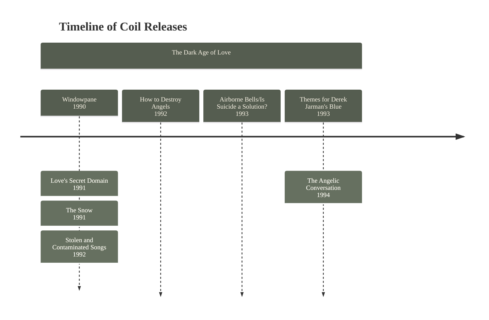
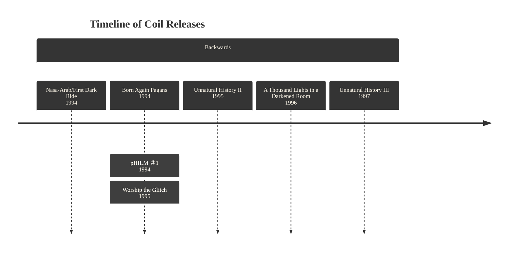
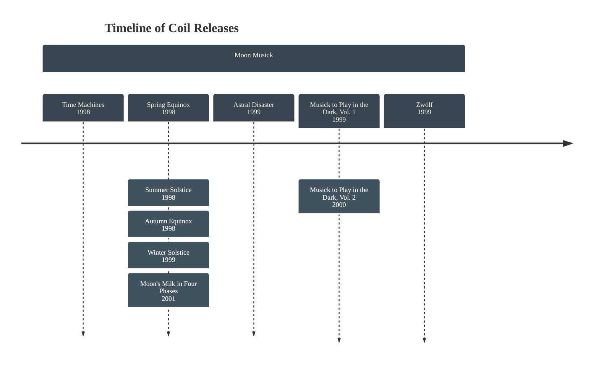
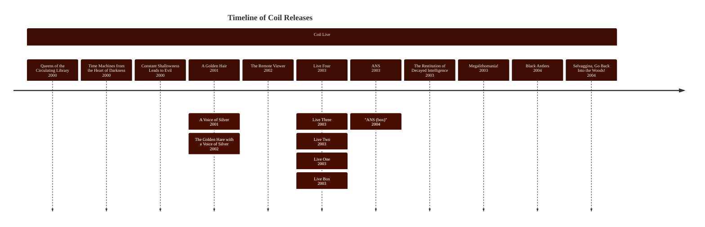
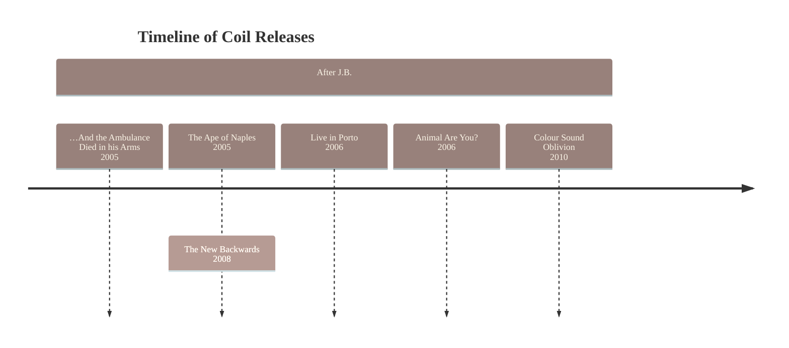
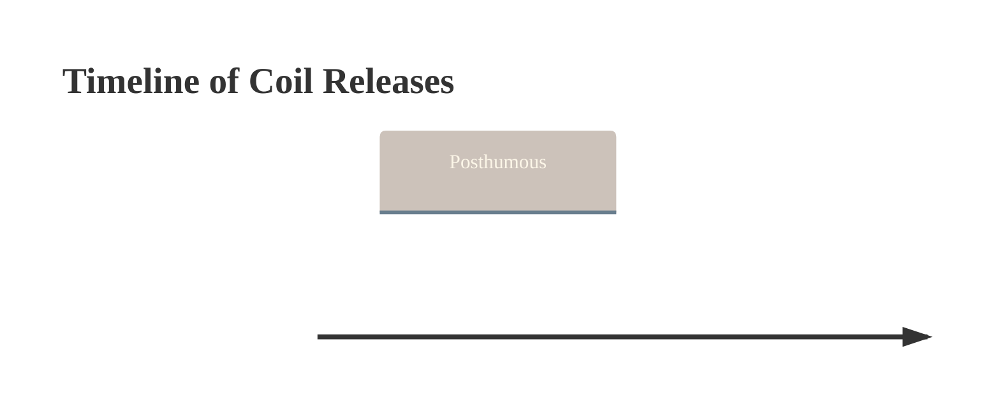
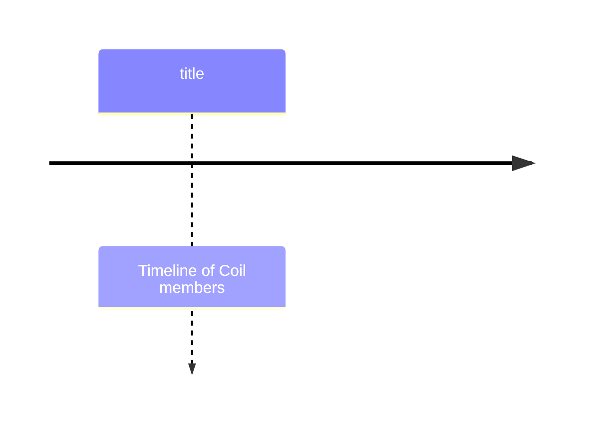

# Coil

Lorem ipsum dolor sit amet, consectetur adipiscing elit, sed do eiusmod tempor incididunt ut labore et dolore magna aliqua.

## History

```mermaid
%%{init: 
   {
    'theme': 'base' , 
    'themeVariables': 
    { 
      'fontFamily': 'Cormorant Garamond Medium',
      'cScale0': '#483C32', 
      'cScaleLabel0': '#FCF6E8',
      'cScale1': '#B35C22',
      'cScaleLabel1': '#FCF6E8',
      'cScale2': '#555D50',
      'cScaleLabel2': '#FCF6E8',
      'cScale3': '#343434',
      'cScaleLabel3': '#FCF6E8',
      'cScale4': '#2A3439',
      'cScaleLabel4': '#FCF6E8',
      'cScale5': '#3D0C02',
      'cScaleLabel5': '#FCF6E8',
      'cScale6': '#98817B',
      'cScaleLabel6': '#FCF6E8',
      'cScale7': '#CCC2BA',
      'cScaleLabel7': '#FCF6E8'
     } 
    } 
}%%
timeline
	title Timeline of Coil Releases
	section Pre-Coil and Early Coil
		Transparent <br> 1984
		How To Destroy Angels <br> 1984
		Dolbied <br> 1984
	section Solar Music
		Scatology <br> 1984 : Panic <br> 1985
		Nightmare Culture <br> 1985
		The Anal Staircase <br> 1986 : Horse Rotorvator <br> 1987 : Gold is the Metal <br> 1987
		The Wheel <br> 1987
		The Consequences of Raising Hell <br> 1987
		Wrong Eye/Scope <br> 1990
		Unnatural History I <br> 1990
	section The Dark Age of Love
		Windowpane <br> 1990 : Love's Secret Domain <br> 1991 : The Snow <br> 1991 : Stolen and Contaminated Songs <br> 1992
		How to Destroy Angels <br> 1992
		Airborne Bells/Is Suicide a Solution? <br> 1993
		Themes for Derek Jarman's Blue <br> 1993 : The Angelic Conversation <br> 1994 
	section Backwards
		Nasa-Arab/First Dark Ride <br> 1994
		Born Again Pagans <br> 1994 : pHILM #1 <br> 1994 : Worship the Glitch <br> 1995
		Unnatural History II <br> 1995
		A Thousand Lights in a Darkened Room <br> 1996
		Unnatural History III <br> 1997
	section Moon Musick
		Time Machines <br> 1998
		Spring Equinox <br> 1998 : Summer Solstice <br> 1998 : Autumn Equinox <br> 1998 : Winter Solstice <br> 1999 : Moon's Milk in Four Phases <br> 2001
		Astral Disaster <br> 1999
		Musick to Play in the Dark, Vol. 1 <br> 1999 : Musick to Play in the Dark, Vol. 2 <br> 2000
		Zwölf <br> 1999
	section Coil Live
		Queens of the Circulating Library <br> 2000
		Time Machines from the Heart of Darkness <br> 2000
		Constant Shallowness Leads to Evil <br> 2000
		A Golden Hair <br> 2001 : A Voice of Silver <br> 2001 : The Golden Hare with a Voice of Silver <br> 2002
		The Remote Viewer <br> 2002
		Live Four <br> 2003 : Live Three <br> 2003 : Live Two <br> 2003 : Live One <br> 2003 : Live Box <br> 2003
		ANS <br> 2003 : "ANS (box)" <br> 2004
		The Restitution of Decayed Intelligence <br> 2003
		Megalithomania! <br> 2003
		Black Antlers <br> 2004
		Selvaggina, Go Back Into the Woods! <br> 2004
	section After J.B.
		…And the Ambulance Died in his Arms <br> 2005
		The Ape of Naples <br> 2005 : The New Backwards <br> 2008
		Live in Porto <br> 2006
		Animal Are You? <br> 2006
		Colour Sound Oblivion <br> 2010
	section Posthumous
```

### Pre-Coil and Early Coil

Lorem ipsum dolor sit amet, consectetur adipiscing elit, sed do eiusmod tempor incididunt ut labore et dolore magna aliqua. Elementum pulvinar etiam non quam lacus. Feugiat in ante metus dictum at tempor  commodo ullamcorper. Placerat orci nulla pellentesque dignissim enim sit amet. Mauris ultrices eros in cursus turpis massa. Sollicitudin nibh sit amet commodo nulla facilisi nullam. Ligula ullamcorper malesuada proin libero nunc consequat. Vulputate mi sit amet mauris commodo quis. Condimentum lacinia quis vel eros. Dictum sit amet justo donec enim. Sit amet volutpat consequat mauris nunc. Leo duis ut diam quam nulla porttitor massa. Quisque sagittis purus sit amet volutpat. Nibh tellus molestie nunc non blandit massa enim.

### Solar Music

Lorem ipsum dolor sit amet, consectetur adipiscing elit, sed do eiusmod tempor incididunt ut labore et dolore magna aliqua. Elementum pulvinar etiam non quam lacus. Feugiat in ante metus dictum at tempor commodo ullamcorper. Placerat orci nulla pellentesque dignissim enim sit amet. Mauris ultrices eros in cursus turpis massa. Sollicitudin nibh sit amet commodo nulla facilisi nullam. Ligula ullamcorper malesuada proin libero nunc consequat. Vulputate mi sit amet mauris commodo quis. Condimentum lacinia quis vel eros. Dictum sit amet justo donec enim. Sit amet volutpat consequat mauris nunc. Leo duis ut diam quam nulla porttitor massa. Quisque sagittis purus sit amet volutpat. Nibh tellus molestie nunc non blandit massa enim.

### The Dark Age of Love

Lorem ipsum dolor sit amet, consectetur adipiscing elit, sed do eiusmod tempor incididunt ut labore et dolore magna aliqua. Elementum pulvinar etiam non quam lacus. Feugiat in ante metus dictum at tempor commodo ullamcorper. Placerat orci nulla pellentesque dignissim enim sit amet. Mauris ultrices eros in cursus turpis massa. Sollicitudin nibh sit amet commodo nulla facilisi nullam. Ligula ullamcorper malesuada proin libero nunc consequat. Vulputate mi sit amet mauris commodo quis. Condimentum lacinia quis vel eros. Dictum sit amet justo donec enim. Sit amet volutpat consequat mauris nunc. Leo duis ut diam quam nulla porttitor massa. Quisque sagittis purus sit amet volutpat. Nibh tellus molestie nunc non blandit massa enim.

### Backwards

Lorem ipsum dolor sit amet, consectetur adipiscing elit, sed do eiusmod tempor incididunt ut labore et dolore magna aliqua. Elementum pulvinar etiam non quam lacus. Feugiat in ante metus dictum at tempor commodo ullamcorper. Placerat orci nulla pellentesque dignissim enim sit amet. Mauris ultrices eros in cursus turpis massa. Sollicitudin nibh sit amet commodo nulla facilisi nullam. Ligula ullamcorper malesuada proin libero nunc consequat. Vulputate mi sit amet mauris commodo quis. Condimentum lacinia quis vel eros. Dictum sit amet justo donec enim. Sit amet volutpat consequat mauris nunc. Leo duis ut diam quam nulla porttitor massa. Quisque sagittis purus sit amet volutpat. Nibh tellus molestie nunc non blandit massa enim.

### Moon Musick

Lorem ipsum dolor sit amet, consectetur adipiscing elit, sed do eiusmod tempor incididunt ut labore et dolore magna aliqua. Elementum pulvinar etiam non quam lacus. Feugiat in ante metus dictum at tempor commodo ullamcorper. Placerat orci nulla pellentesque dignissim enim sit amet. Mauris ultrices eros in cursus turpis massa. Sollicitudin nibh sit amet commodo nulla facilisi nullam. Ligula ullamcorper malesuada proin libero nunc consequat. Vulputate mi sit amet mauris commodo quis. Condimentum lacinia quis vel eros. Dictum sit amet justo donec enim. Sit amet volutpat consequat mauris nunc. Leo duis ut diam quam nulla porttitor massa. Quisque sagittis purus sit amet volutpat. Nibh tellus molestie nunc non blandit massa enim.

### Coil Live

Lorem ipsum dolor sit amet, consectetur adipiscing elit, sed do eiusmod tempor incididunt ut labore et dolore magna aliqua. Elementum pulvinar etiam non quam lacus. Feugiat in ante metus dictum at tempor commodo ullamcorper. Placerat orci nulla pellentesque dignissim enim sit amet. Mauris ultrices eros in cursus turpis massa. Sollicitudin nibh sit amet commodo nulla facilisi nullam. Ligula ullamcorper malesuada proin libero nunc consequat. Vulputate mi sit amet mauris commodo quis. Condimentum lacinia quis vel eros. Dictum sit amet justo donec enim. Sit amet volutpat consequat mauris nunc. Leo duis ut diam quam nulla porttitor massa. Quisque sagittis purus sit amet volutpat. Nibh tellus molestie nunc non blandit massa enim.

### After J.B

Lorem ipsum dolor sit amet, consectetur adipiscing elit, sed do eiusmod tempor incididunt ut labore et dolore magna aliqua. Elementum pulvinar etiam non quam lacus. Feugiat in ante metus dictum at tempor commodo ullamcorper. Placerat orci nulla pellentesque dignissim enim sit amet. Mauris ultrices eros in cursus turpis massa. Sollicitudin nibh sit amet commodo nulla facilisi nullam. Ligula ullamcorper malesuada proin libero nunc consequat. Vulputate mi sit amet mauris commodo quis. Condimentum lacinia quis vel eros. Dictum sit amet justo donec enim. Sit amet volutpat consequat mauris nunc. Leo duis ut diam quam nulla porttitor massa. Quisque sagittis purus sit amet volutpat. Nibh tellus molestie nunc non blandit massa enim.

### Posthumous

Lorem ipsum dolor sit amet, consectetur adipiscing elit, sed do eiusmod tempor incididunt ut labore et dolore magna aliqua. Elementum pulvinar etiam non quam lacus. Feugiat in ante metus dictum at tempor commodo ullamcorper. Placerat orci nulla pellentesque dignissim enim sit amet. Mauris ultrices eros in cursus turpis massa. Sollicitudin nibh sit amet commodo nulla facilisi nullam. Ligula ullamcorper malesuada proin libero nunc consequat. Vulputate mi sit amet mauris commodo quis. Condimentum lacinia quis vel eros. Dictum sit amet justo donec enim. Sit amet volutpat consequat mauris nunc. Leo duis ut diam quam nulla porttitor massa. Quisque sagittis purus sit amet volutpat. Nibh tellus molestie nunc non blandit massa enim.

## Personnel

## Aliases and Side-projects

### Zos Kia

__Zos Kia__ was a musical project led by [[John Gosling]], and consisting of Gosling, [[Jhonn Balance|John Balance]] and Min Kent, with [[Peter Christopherson]] assisting as Mixing Engineer for their concert at [[1983-12-03 — Atonal Festival Ⅲ|Atonal Festival III]]. This concert was one of the first performances by Coil and would produce the first release credited to them, [[Transparent]]. Balance and Christopherson left the project some time shortly after this performance to focus on Coil.[^GoslingBio] In spite of this, Gosling would continue the project under his direction for a few more years, releasing the two singles *Rape* in 1984 and *Be Like Me* in 1985.[^ZKDiscog] A complete compilation of the recordings released by the project would be published by [[Infinite Fog Production]] in 2017 as *23*.[^ZK23]

### ELpH

### Black Light District

### The Eskaton

### Rosa Mundi

## References

[^GoslingBio]: <https://www.brainwashed.com/common/htdocs/biog/goslingj.php>
[^ZKDiscog]: <https://www.discogs.com/artist/80028-Zos-Kia>
[^ZK23]: <https://infinitefog.ru/shop/cd/zos-kia-23-2cd-digibook.html>
